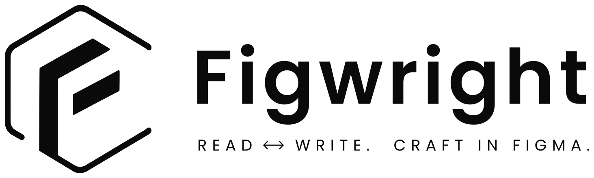
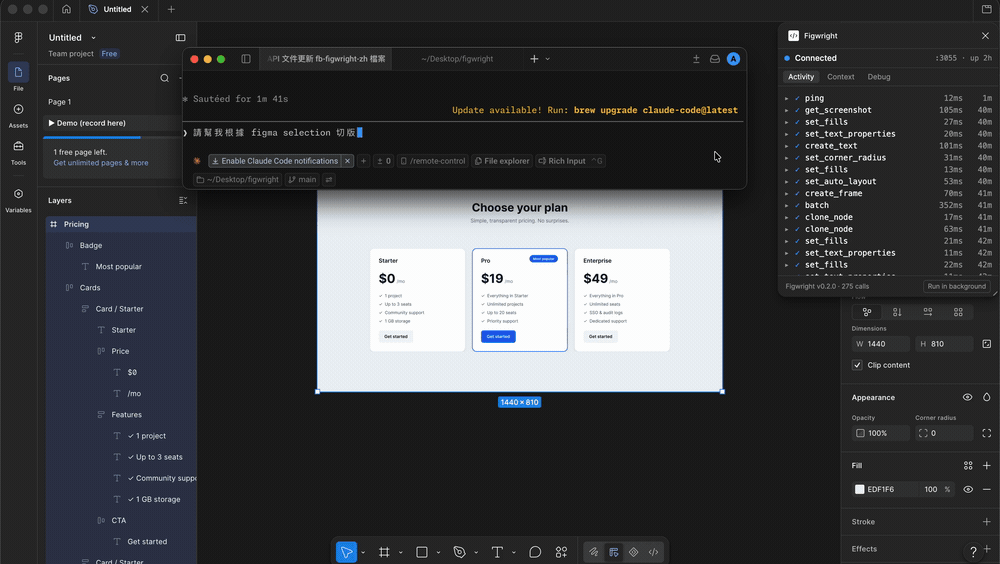
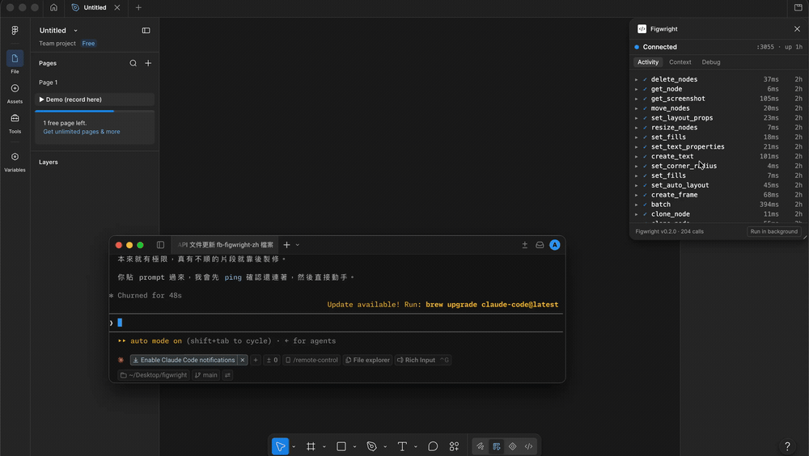
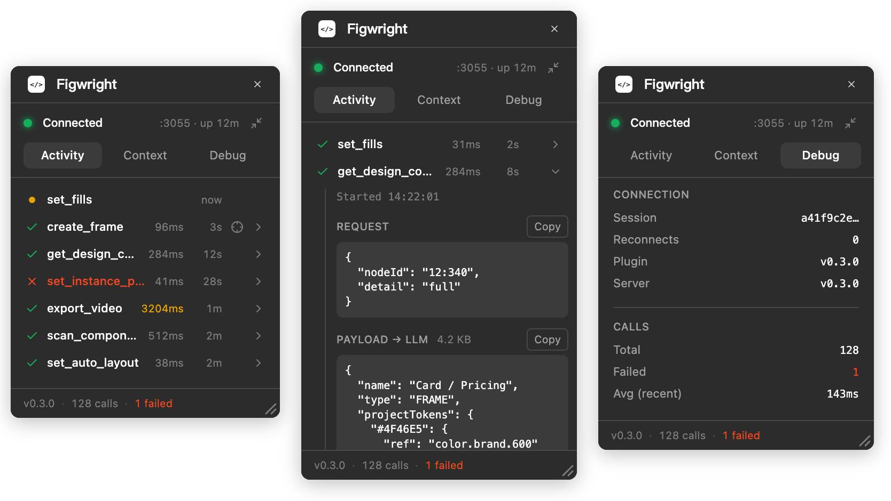
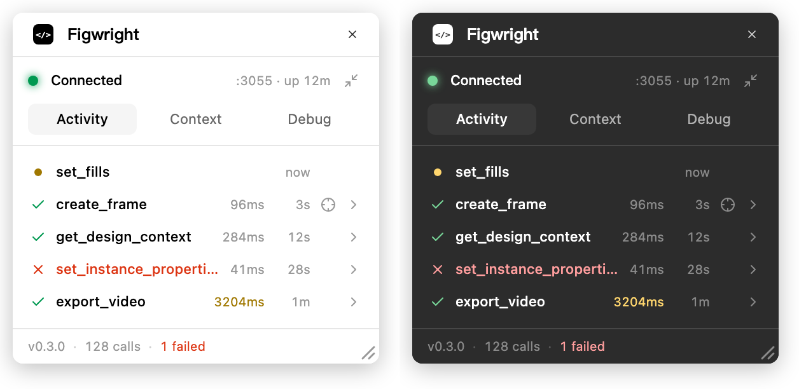
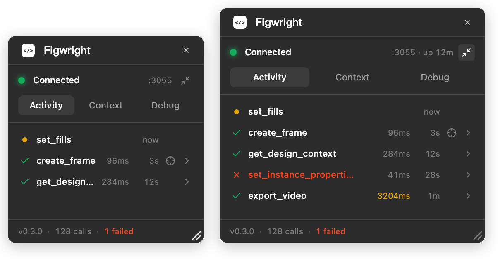

<div align="center">

<br />

<picture><source media="(prefers-color-scheme: dark)" srcset="./.github/assets/logo-full-dark.svg"><source media="(prefers-color-scheme: light)" srcset="./.github/assets/logo-full-light.svg"></picture>

<br />

<p align="center">
  供 AI 程式開發代理使用的免費雙向 Figma MCP 伺服器。
  <br />
  搭配 Figma 外掛即可使用，不需要 Dev Mode 席次。
</p>

[English](./README.md) · **繁體中文** · [简体中文](./README.zh-CN.md)

[關於](#about) · [安裝設定](#setup) · [Skills](#skills) · [工具](#tools) · [外掛](#plugin) · [常見問題](#faq) · [參與貢獻](#contributing)

[](https://www.npmjs.com/package/@figwright/mcp)
[](https://github.com/awdr74100/figwright/actions/workflows/ci.yml)
[](./LICENSE)

<a href="https://trendshift.io/repositories/68274?utm_source=trendshift-badge&amp;utm_medium=badge&amp;utm_campaign=badge-trendshift-68274" target="_blank" rel="noopener noreferrer"></a>

</div>

本頁為繁體中文版；內容如有差異，請以 [English README](./README.md) 為準。

<a name="about"></a>

## 關於 Figwright

Figwright 透過本機 WebSocket 中繼服務，連接 **MCP 伺服器**與 **Figma 外掛**，讓 AI 代理（Claude Code、Cursor、Codex 或其他 MCP client）能直接操作 Figma，不只是讀取設計。

它支援兩個方向的工作流程：

**讀取設計**：取得準確反映原稿、已去除重複內容的設計資訊（版面配置、文字排版、變數與元件），將 Figma 中選取的內容轉成符合專案框架的程式碼。

<p align="center">
  
</p>

**編輯設計**：直接在畫布上建立與修改內容，從框架（frame）、文字、自動版面配置（auto-layout）、樣式、變數、元件，到整個畫面都能處理。

<p align="center">
  
</p>

Figwright 的伺服器、中繼服務與外掛都在你的電腦上執行，沒有 Figwright 雲端服務。設計資料會交給 MCP client；client 是否將資料傳給模型供應商，取決於你的設定。

<a name="why-figwright"></a>

## 為什麼選擇 Figwright

- **支援免費方案**：Figwright 使用 Figma 免費方案即可運作，不需要付費的 Dev Mode 席次。官方 Figma MCP 則有[依方案與席次而異的存取權限及用量限制](https://developers.figma.com/docs/figma-mcp-server/rate-limits-access/)，免費方案也有有限額度。
- **雙向操作**：**113 個工具**涵蓋畫布的讀取與編輯，讓代理既能依設計實作程式碼，也能直接建立設計。
- **依專案產生程式碼**：採用 provider-first 的設計理念，偵測專案實際使用的框架與樣式方案，並沿用既有元件、設計 token 和圖示，減少重新調整通用程式碼的工作。
- **每個代理各自綁定檔案**：多個代理可同時工作，各自綁定已開啟的 Figma 檔案。切換分頁時，不會把某個代理的修改寫進另一份設計；詳見[常見問題](#faq)中的多檔案操作說明。
- **開放且可擴充**：讀取與編輯工作流程都以可安裝的 [skills](#skills) 提供，你可以直接採用，也可以 fork 後自行調整。

<a name="setup"></a>

## 安裝設定

你需要 **MCP client**（Claude Code、Cursor 等）、**Node.js 20.19+ 或 22.12+**，以及 **Figma**。使用 Figma 免費方案即可，但匯入外掛時需要桌面版。伺服器由 `npx` 啟動為獨立程序，因此它使用的 Node 版本可以與專案建置所用的版本不同；不支援 Node 18、21 與 22.0–22.11。

### 1. 將伺服器加入 MCP client

以 Claude Code 為例，將以下設定加入 `.mcp.json`。其他 client 請依各自的 MCP 設定格式，填入相同的啟動指令與參數：

```json
{
  "mcpServers": {
    "figwright": {
      "command": "npx",
      "args": ["-y", "@figwright/mcp@latest"]
    }
  }
}
```

`npx` 會下載並執行已發布的伺服器套件，不需要全域安裝。

### 2. 安裝 Figma 外掛

外掛尚未上架 Figma Community，請從最新版本下載安裝：

1. 前往 [**GitHub 最新版本**](https://github.com/awdr74100/figwright/releases/latest)，下載外掛 zip 並解壓縮。
2. 在 Figma **桌面版**依序選擇 **Menu → Plugins → Development → Import plugin from manifest…**，然後選取解壓縮後的 `manifest.json`。

### 3. 建立連線

在 Figma 開啟 Figwright 外掛（**Plugins → Development → Figwright**）。它會自動連上本機伺服器，並顯示 **Connected**。請代理執行 `ping`，確認連線正常。

### 4. 安裝 skills（選用）

[Skills](#skills) 會引導代理在適合的任務中使用 Figwright，並依據實際設計與專案資訊完成工作：

```bash
npx skills add awdr74100/figwright/skills
```

### 5. 使用範例

在 Figma 選取一個框架，並向代理提供以下指令：

> _將 Figma 目前選取的內容實作為 React 元件。_

也可以反過來，請代理建立設計：

> _依照這份規格，在 Figma 建立一個方案定價區塊。_

<a name="skills"></a>

## Skills

Agent skills 定義如何搭配 Figwright 的工具完成各項工作流程。當任務符合某個 skill 的描述時，代理會自行載入，不需要手動呼叫。

| Skill                                              | 功能                                                                  |
| :------------------------------------------------- | :-------------------------------------------------------------------- |
| [`figma‑codegen`](./skills/figma-codegen/SKILL.md) | 根據專案的技術組合與既有元件，將 Figma 選取內容轉成符合框架的程式碼。 |
| [`figma‑build`](./skills/figma-build/SKILL.md)     | 根據程式碼或文字描述建立 Figma 設計，並沿用檔案中的既有元件與樣式。   |

透過 [`skills`](https://www.skills.sh) CLI，可安裝到任何受支援的代理：

```bash
npx skills add awdr74100/figwright/skills      # 安裝兩個 skills
npx skills add https://github.com/awdr74100/figwright/tree/main/skills/figma-codegen  # 只安裝一個
```

> [!NOTE]
> Skills 需要已連線的 `@figwright/mcp` 伺服器才能運作；只安裝 skills 並不會提供可呼叫的工具。

<a name="tools"></a>

## 工具

Figwright 提供 **113 個 MCP 工具**，分為三類：

- **讀取**：查看選取內容、文件、節點、樣式、變數、元件、字型、互動設定（reactions）與 Motion 動畫狀態；擷取畫面、取得圖片填色的原始素材、匯出 PDF，以及將動畫框架匯出為影片（MP4／GIF／WebM）。另有 `list_files`／`use_file`，可同時處理多份已開啟的 Figma 檔案。
- **編輯**：建立與修改框架、文字、形狀、自動版面配置、效果、樣式、變數、元件（包含布林、文字與實例替換屬性）、頁面、互動設定，以及 Motion 動畫（關鍵影格、動畫樣式預設與時間軸）。也能用 `batch` 批次套用多項修改。
- **設計與程式碼對照（Grounding）**：`get_design_context` 提供準確反映原稿且已去除重複內容的設計資訊；`component_map`／`token_map`／`icon_map` 將 Figma 資料對應到專案程式碼，讓產生的程式碼沿用既有實作。`design_diff` 則會比對已儲存的基準，列出設計變更，讓你只需更新受影響的程式碼。

> [!TIP]
> MCP client 會在連線時列出所有工具；請以這份清單為準，它反映的是目前伺服器實際提供的工具。

<a name="plugin"></a>

## 外掛

Figma 外掛會呈現完整的執行資訊：每次工具呼叫都會即時顯示，你可以查看實際傳給模型的資料，也能掌握連線狀況。

<p align="center">
  
</p>

<p align="center">
  <sub><b>Activity</b>：每次呼叫的紀錄、耗時，以及跳轉至相關節點的入口 · <b>Payload</b>：模型實際收到的資料 · <b>Debug</b>：連線狀況、版本資訊與一鍵匯出診斷資料</sub>
</p>

外掛也會隨 Figma 切換淺色或深色主題。

<p align="center">
  
</p>

拖曳面板右下角即可調整大小；增加高度可顯示更多紀錄，設定的尺寸會在下次開啟時保留。若要隱藏面板，請點選標題列中、Figma ✕ 按鈕下方的 **Run in background**。隱藏後仍會維持連線，代理可繼續執行長時間任務；再次執行外掛即可重新顯示面板。上方的 ✕ 則會關閉外掛，同時中斷連線。

<p align="center">
  
</p>

<p align="center">
  <sub><b>調整大小</b>：拖曳角落，尺寸會自動保留 · <b>背景執行</b>：隱藏面板，中繼連線不中斷</sub>
</p>

<a name="how-it-works"></a>

## 運作方式

MCP client 透過 stdio 與 `@figwright/mcp` 伺服器通訊，伺服器再經由本機 WebSocket 將請求轉送給 Figma 外掛。多個 client 可以共用同一個外掛，由選舉機制決定哪個伺服器負責連線；傳輸層也具備連線中斷後的復原機制：

```text
┌─────────────────────────────────────────────────────────────────────┐
│ MCP CLIENTS · 每個代理各有一個用戶端                                │
│ Claude Code · Cursor · Claude · 其他支援 MCP 的用戶端               │
└─────────────────────────────────────────────────────────────────────┘
                                   │  透過 stdio 傳輸 MCP 訊息
                                   ▼
┌─────────────────────────────────────────────────────────────────────┐
│ @figwright/mcp · 每個用戶端啟動一個，並選出 leader                  │
│                                                                     │
│ LEADER（負責維持外掛連線）                                          │
│    • WebSocket 中繼 · 請求冪等性                                    │
│    • 將請求路由至最近操作的檔案                                     │
│    • 工作階段復原 · 心跳機制區分忙碌與失聯                          │
│    • 端點：/ws（外掛）· /ping（健康檢查）· /rpc（followers）        │
│                                                                     │
│ FOLLOWERS                                                           │
│    • 透過 HTTP /rpc 將工具呼叫轉送給 leader                         │
│    • leader 結束時自動接手                                          │
└─────────────────────────────────────────────────────────────────────┘
                                   │  本機 WebSocket · msgpack（二進位）
                                   ▼
┌─────────────────────────────────────────────────────────────────────┐
│ FIGMA（桌面版或瀏覽器）                                             │
│                                                                     │
│ ┌─────────────────────────────────────────────────────────────────┐ │
│ │ Figwright 外掛                                                  │ │
│ │   • UI（Vue 3 iframe）：WebSocket 用戶端與心跳                  │ │
│ │   • sandbox：執行 Figma Plugin API 呼叫                         │ │
│ └─────────────────────────────────────────────────────────────────┘ │
│                                                                     │
│              │ Figma Plugin API                                     │
│              ▼                                                      │
│            畫布                                                     │
└─────────────────────────────────────────────────────────────────────┘
```

圖中 LEADER 是負責外掛連線的主伺服器，FOLLOWERS 是轉送呼叫的其他伺服器。UI 在 iframe 中維持 WebSocket 與心跳；sandbox 負責呼叫 Figma Plugin API，操作畫布。

Figwright 採用 **provider-first** 的設計理念：工具負責提供準確的設計資訊，再由模型產生符合你的專案的程式碼，而不是套用固定的編譯流程。[`figma-codegen`](#skills) skill 將這套做法整理成代理可遵循的工作流程。

<a name="security"></a>

## 安全性

Figwright 本身的資料傳輸都在本機進行：client 啟動伺服器後透過 stdio 與它通訊，伺服器再透過 `127.0.0.1:3055` 上的 WebSocket 與外掛通訊。Figwright 沒有雲端服務，也不會傳送遙測資料。MCP client 會收到工具回傳結果；設計資料是否進一步傳給遠端模型供應商，取決於 client 與你的設定。外掛只使用 Figma 公開的 Plugin API 存取已開啟的檔案。

只綁定 loopback 位址並不足以構成安全邊界，因為你瀏覽的網頁仍可能連到本機連接埠。因此，中繼服務會檢查每個請求中、網頁無法任意偽造的兩個標頭：**`Host`** 必須指向 loopback 位址，用來防止 DNS rebinding；**`Origin`** 則允許外掛沙箱的交握，拒絕其他瀏覽器來源。Leader 的 HTTP 端點還要求使用必須先通過 CORS 預檢才能傳送的媒體類型。一般安全原則請參閱 [MCP Security Best Practices](https://modelcontextprotocol.io/docs/tutorials/security/security_best_practices)；Figwright 的威脅模型、涵蓋範圍與私下回報漏洞的方式，請見 [SECURITY.md](./SECURITY.md)。

**即使使用 Figwright，你仍需要確認代理的操作。** 寫入工具會修改 Figma 檔案，匯出工具則會將檔案寫入代理指定的路徑。如果代理受到惡意設計內容或提示注入指令影響，這兩類工具都可能遭到濫用。MCP client 的工具執行審核機制才是關鍵的防線。

<a name="faq"></a>

## 常見問題

<details>
<summary><strong>伺服器無法啟動：出現 <code>command not found</code>，或以 <code>-32000</code>（「Connection closed」）錯誤中斷連線。</strong></summary>

這兩種情況均與 MCP client 啟動伺服器的方式有關：它會直接執行 `command`，不會經過互動式 shell，因此也不會載入 shell 啟動時的設定。使用 **fnm、nvm、asdf、volta、mise** 等 Node 版本管理工具時尤其常見，因為它們通常透過終端機啟動時的 shell hook 設定 `PATH` 與 npm。這並非 Figwright 特有的問題，任何透過 `npx` 啟動的 MCP 伺服器都可能遇到。以下兩種症狀需要分別處理。

**`command not found`：client 無法從 `PATH` 找到 `npx`／`node`。**

- **改用絕對路徑。** 在一般終端機執行 `which npx`（或 `which node`），再將取得的完整路徑填入 `command`：

  ```json
  {
    "mcpServers": {
      "figwright": {
        "command": "/Users/you/.local/share/fnm/node-versions/v24.x.x/installation/bin/npx",
        "args": ["-y", "@figwright/mcp@latest"]
      }
    }
  }
  ```

- **或透過 `env` 傳入 `PATH`。** 如果 client 支援為個別伺服器設定 `env`，請將版本管理工具的 `bin` 目錄加入 `env.PATH`。

**`-32000`／「Connection closed」／始終無法連線：`npx` 已執行，但伺服器在交握前即結束。**

`npx … @latest` **每次**啟動都會向套件登錄服務（registry）查詢最新版本。在 client 直接啟動的環境中，此步驟可能失敗或停滯，例如 npm 設定未載入或與終端機不同、公司代理伺服器或私有 registry 尚未設定，或當時無法連網。程序因此在 MCP 建立連線前就結束，client 便會顯示連線已關閉。（執行檔的 shebang 找不到 `node` 時，也會出現這種情況。）

可先安裝套件，讓啟動過程不必再向 registry 下載：

- **安裝為專案相依套件。** 安裝後，請從設定中**移除 `@latest`**。這個標籤會強制查詢 registry；移除後，`npx` 就會使用 `node_modules` 裡已安裝的版本（例如 Claude Code 的 `.mcp.json` 等專案層級設定，會從專案根目錄啟動程序）：

  ```bash
  pnpm add -D @figwright/mcp   # 或：npm i -D @figwright/mcp
  ```

  ```json
  {
    "mcpServers": {
      "figwright": {
        "command": "npx",
        "args": ["-y", "@figwright/mcp"]
      }
    }
  }
  ```

- **或全域安裝，直接指定執行檔。** 安裝一次後，讓 `command` 直接指向執行檔，即可省去 `npx` 與每次啟動時的版本查詢。請使用 `which figwright-mcp` 查到的絕對路徑：

  ```bash
  npm i -g @figwright/mcp
  which figwright-mcp
  ```

  ```json
  {
    "mcpServers": {
      "figwright": {
        "command": "/absolute/path/to/figwright-mcp"
      }
    }
  }
  ```

</details>

<details>
<summary><strong>外掛一直顯示「Waiting」，無法連線。</strong></summary>

伺服器由 MCP client 啟動，因此只會在 client 執行期間運作。請確認：

- MCP client 正在執行，且已設定 Figwright（可試著呼叫 `ping`）。
- 外掛已在同一台電腦、**同一個** Figma 應用程式中開啟（中繼服務只能透過本機 `127.0.0.1` 存取）。
- 本機 loopback 連線沒有被阻擋；部分防火牆或安全工具可能會攔截。

</details>

<details>
<summary><strong>如何確認伺服器與外掛版本相容？</strong></summary>

外掛的 **Debug** 分頁會並列顯示伺服器與外掛版本，可直接比對差異。

通常不需要手動檢查，因為外掛會主動提示影響相容性的版本差異。伺服器與外掛的更新管道不同：伺服器透過 `npx @latest` 在每次啟動時查詢最新版本；外掛則需手動匯入 zip 更新。因此，版本不同步是常態。問題也不一定會報錯：舊版處理函式會直接忽略不支援的參數，導致工具回報成功，卻只完成部分要求。當外掛版本舊到可能影響執行結果時，面板會顯示警告與更新方式，每次工具回傳結果也會告知代理，該結果未經驗證。

無影響的版本差異不會觸發警告，例如伺服器雖然更新了版本，卻沒有更動參數，外掛即使落後一版也不影響使用。若出現警告，請依指示更新外掛。

</details>

<details>
<summary><strong>需要付費的 Figma 方案或 Dev Mode 嗎？</strong></summary>

不需要。Figwright 透過外掛與 Figma 溝通，免費方案就能使用，不需要 Dev Mode 席次或其他付費方案。

</details>

<details>
<summary><strong>可以在 Dev Mode 和 FigJam 使用嗎？</strong></summary>

可以，但可用功能少於 Figma Design。這是編輯器提供給外掛的 API 限制，並非 Figwright 刻意限制功能。

- **Figma Design**：支援完整功能。
- **Dev Mode**（Inspect 面板）：只能讀取與匯出。Figma 在此模式下只允許外掛讀取，因此截圖、PDF 匯出與所有檢視工具都能使用，但任何寫入都會失敗，包括節點、頁面、變數與樣式。適合用來產生程式碼；若要建立或修改設計，請切回 Design 模式。（面板也不提供調整大小與 **Run in background**，因為這裡的視窗由 Figma 控制。）
- **FigJam**：可操作框架、區段、形狀與文字；此編輯器沒有元件、變數、樣式或 Motion，因此不適用這些工具。

`get_metadata` 會回報編輯器資訊（`editorType`／`mode`）。如果工具因編輯器限制而失敗，錯誤訊息也會說明原因，讓代理能調整做法，而不是反覆重試。

</details>

<details>
<summary><strong>多個代理可以同時使用同一個外掛嗎？</strong></summary>

可以。多個 MCP 伺服器透過 leader／follower **選舉機制**共用同一個外掛：由其中一個擔任 leader，其餘作為 follower；leader 結束時會自動交接。

</details>

<details>
<summary><strong>兩個代理可以同時處理不同的 Figma 檔案嗎？</strong></summary>

可以，需先讓每個代理分別綁定檔案。

預設情況下，工具呼叫會送到你最近操作的檔案，切換分頁也就改變了代理看到的內容。這適合單一代理，但兩個代理同時工作時，背景檔案的代理可能會在不知情的情況下取得另一份檔案的節點。只要同時開啟多份檔案，而代理尚未綁定其中一份，每次回傳結果都會提醒它先綁定，避免以錯誤的檔案為基礎繼續工作。

`list_files` 會列出目前有開啟外掛的所有檔案，`use_file` 則將其中一份綁定給該代理：

```text
> 使用行銷網站的檔案
  → use_file({ fileName: "Marketing Site" })
```

綁定只屬於該代理自己的伺服器程序，不會影響其他代理；即使關閉後重新開啟外掛面板，綁定也會保留。檔案分頁放在背景時，工具呼叫仍會送到該檔案。綁定以程序為單位，每個 MCP client 各有一個，因此要讓代理分別使用兩個 client，例如兩個編輯器或兩個終端機。同一個 client 裡的所有代理（包含子代理）共用伺服器，因此共用同一份檔案綁定。若兩個已開啟的檔案同名，`use_file` 不會猜測，而會要求使用 `list_files` 列出的 `sessionId`。呼叫 `use_file({ release: true })` 可解除綁定，回到跟隨前景檔案的模式。

</details>

<a name="contributing"></a>

## 參與貢獻

歡迎參與貢獻。開發環境設定與提交 pull request 的流程，請參閱 **[CONTRIBUTING.md](./CONTRIBUTING.md)**；架構、目錄配置、技術組合與開發慣例，請見 **[AGENTS.md](./AGENTS.md)**。

<a name="whats-in-the-name"></a>

## 名字的由來

`figwright` 沿用英文 **_-wright_** 的命名傳統，這個古老字詞指的是製作者或工匠：**playwright** 寫劇本、**shipwright** 造船、**wheelwright** 製作車輪。名字也向瀏覽器自動化工具 [**Playwright**](https://playwright.dev) 致意：Playwright 操作瀏覽器，**Figwright** 則操作 Figma，既能讀取畫布，也能建立與修改設計。

<a name="license"></a>

## 授權

[MIT](./LICENSE) © Roya
